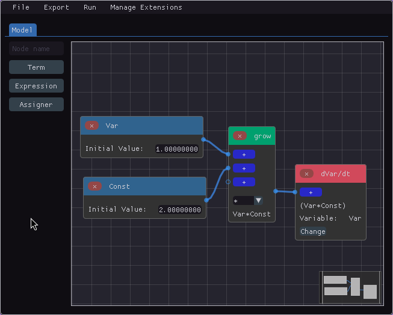
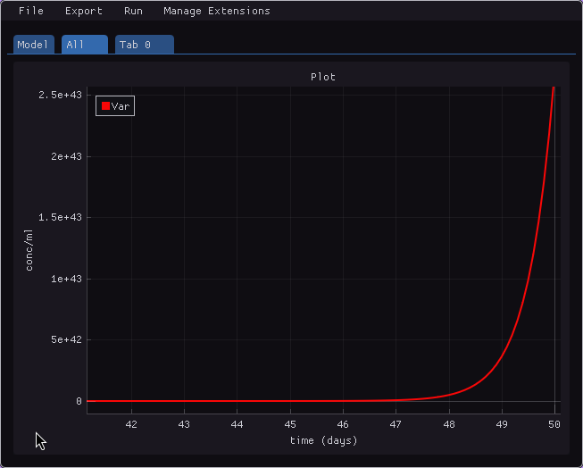
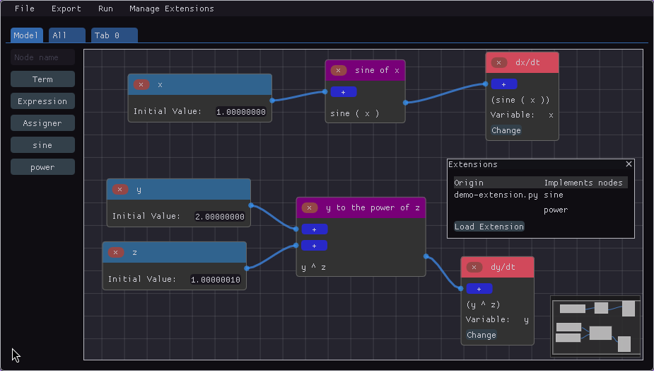
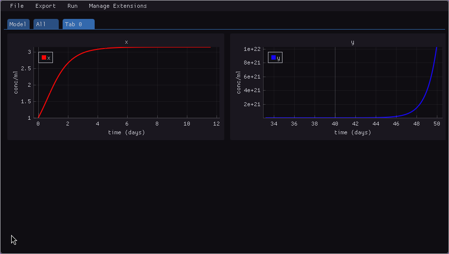

## Functionalities

### Node-based editor



### Plotting



### Python code export and pdf export

```py
# imports of scipy and numpy omitted

def initial_values() -> np.ndarray:
    Var_0 = 1.0
    return np.array((Var_0,))


def constants() -> list:
    Const = 2.0
    return [Const]


def variable_names() -> list[str]:
    return ["Var"]


def system(t: np.float64, y: np.ndarray, *constants) -> np.ndarray:
    Var, = y
    Const, = constants

    dVar_dt = Var*Const

    return np.array([dVar_dt])

# Rest of the code used to simulate and plot to PDF omitted
```

### Extensibility via Python code

Given the following Python code:

```py
import math

@node
def sine(x):
    return math.sin(x)


@node(format="$1 ^ $2")
def power(x, y):
    return x ** y
```

By importing it in the *Manage Extensions* menu, you can use the defined nodes as if they were native, as in the image below.



The code can be used to simulate just like native nodes.

