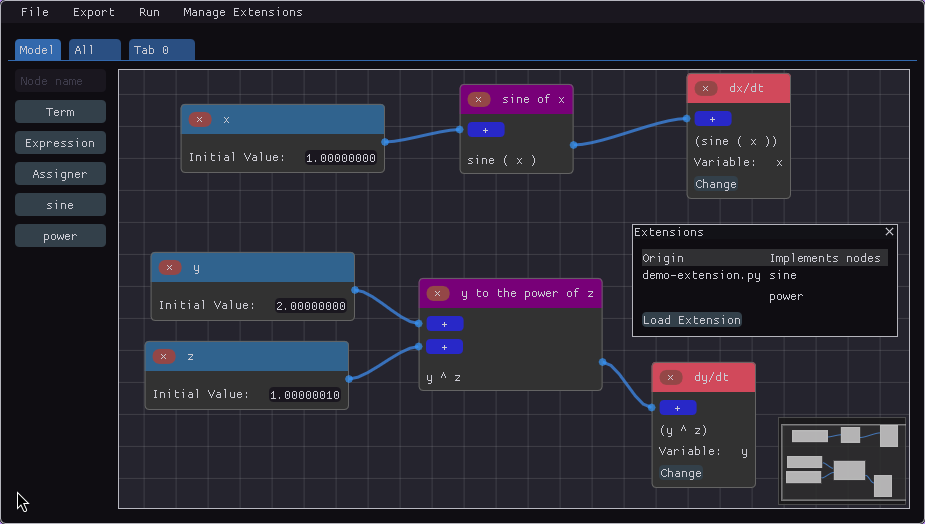
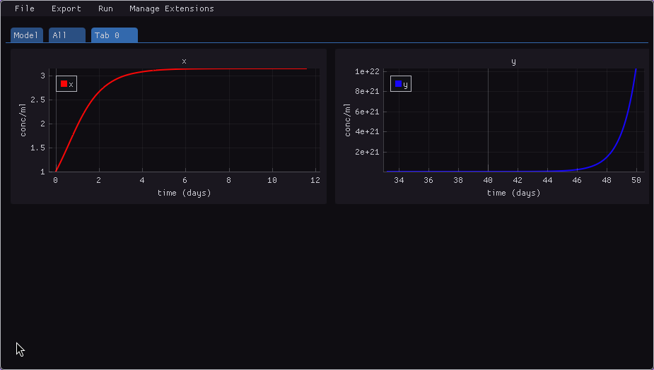

# Extensibility
To create a new operational module if your modeling needed, give the following Python code:

```py
import math

@node
def sine(x):
    return math.sin(x)


@node(format="$1 ^ $2")
def power(x, y):
    return x ** y
```

By importing it in the *Manage Extensions* menu, you can use the defined nodes as if they were native, as in the image below.



The code can be used to simulate just like native nodes.


