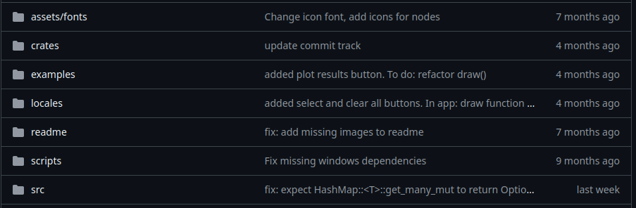
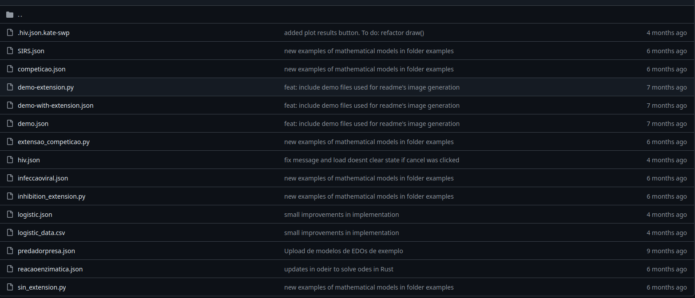
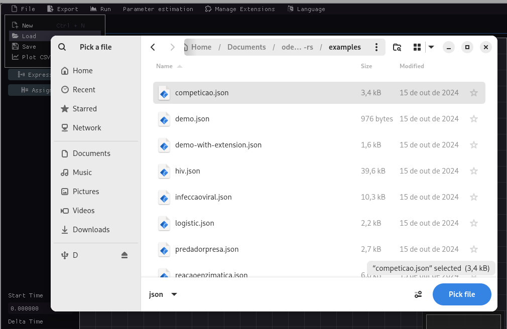

# Runnig a example

- To run a example frist go to the official repository [ode-designer-rs](https://github.com/ufsj-dcomp/ode-designer-rs);
- Inside the repository open the example folder, where inside have the .json files

- Choose one example to run and download that. After this process go to the software.

- In the softwre in top menu click in the file option, when open click in load option. 

- This option will open a window where permit to choose a file and execute that.

- How this process the model is loaded in the software 

